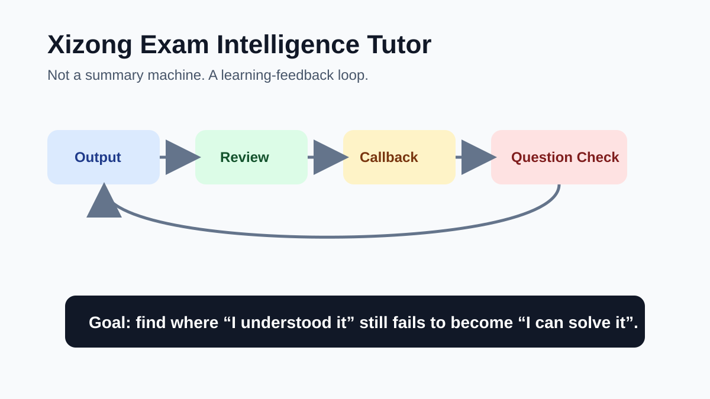
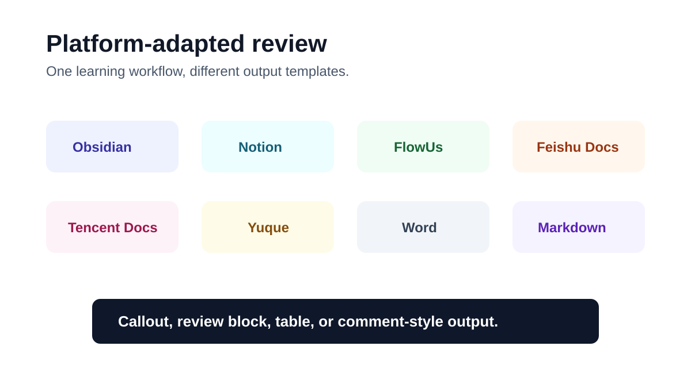
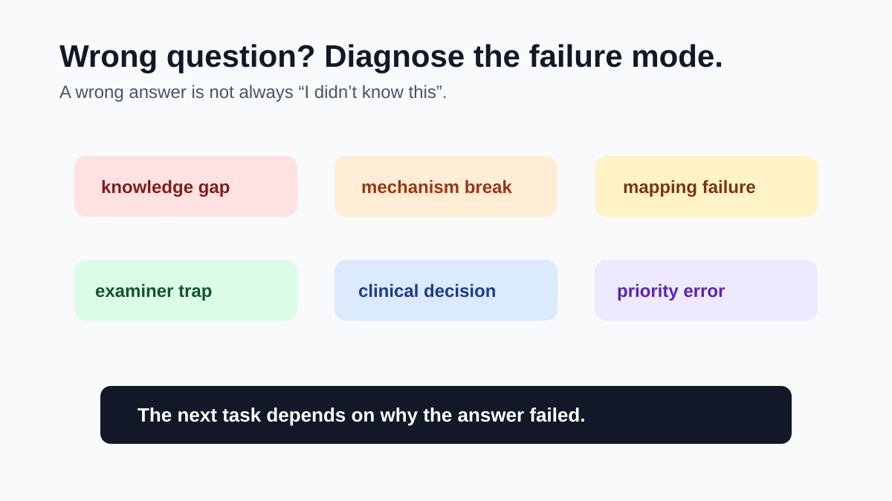
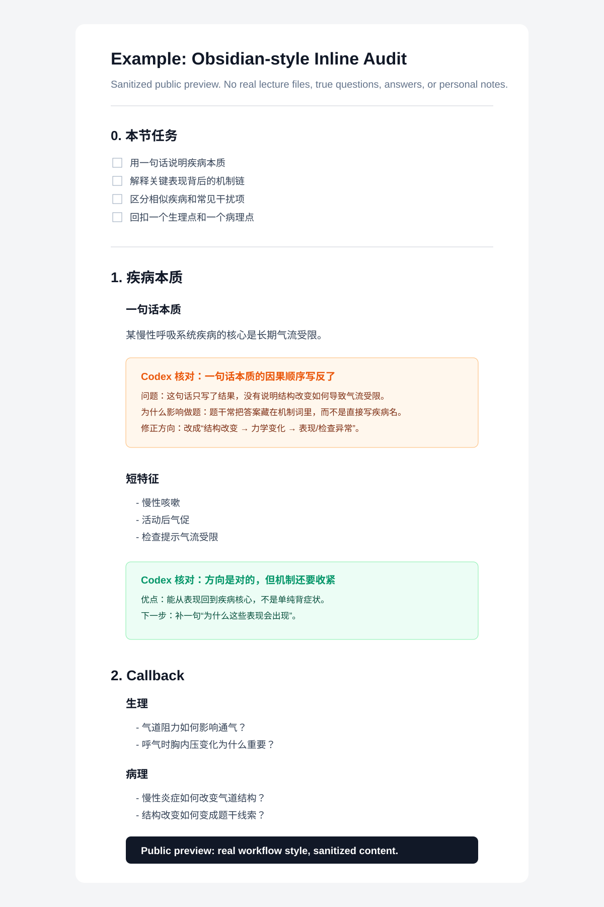

# Xizong Exam Intelligence Tutor

Most 西综 learners do not fail because they need one more summary. They fail at the harder step: turning lecture knowledge into their own explanation, then turning that explanation into exam decisions.

`Xizong Exam Intelligence Tutor` is a public Codex skill for that exact gap. It reviews the learner's own output, identifies whether the understanding is stable, catches mechanism breaks, diagnoses wrong-question patterns, and only enters fast option-decision mode when a complete question stem and options are provided.

It is not a question-bank generator, prediction tool, or encyclopedia summarizer. It is a professional learning tutor for active output, review, callback, and exam-reasoning feedback for 考研西综 / 306.

Skill folder: `skills/xizong-study-review`

This repository is a public, sanitized release. It contains the learning workflow, prompt contracts, templates, preview assets, and safety boundaries. It does not contain lecture PDFs, true-question PDFs, answer keys, explanations, OCR outputs, unredacted personal notes, or private learning records. One redacted workflow screenshot is included with permission to show how inline review looks in practice.



## What You Get

1. **Output review that preserves the learner's words.** Codex inserts targeted review blocks under the original paragraph instead of replacing the note with a polished AI summary.
2. **Learning-state feedback.** It distinguishes `beginner`, `unstable`, `consolidating`, `exam-ready`, `confused-zone`, and `unsure`.
3. **Mechanism repair.** It connects physiology, pathology, and clinical reasoning when the chain breaks.
4. **Wrong-question diagnosis.** It separates knowledge gaps, mechanism breaks, mapping failures, examiner traps, clinical decision errors, and priority errors.
5. **Responsible true-question use.** True questions are used to understand exam expression and distractor design, not to redistribute source files or predict the exam.
6. **Decision Engine v1 when appropriate.** If the learner provides a complete stem and options, Codex can compress reasoning into option elimination and a forced `FINAL DECISION`.

## Quick Start

Clone the repository:

```bash
git clone https://github.com/techicen/xizong-study-review.git
cd xizong-study-review
```

Install the skill:

```bash
bash scripts/install-skill.sh
```

On Windows:

```bat
scripts\install-skill.bat
```

Restart Codex, then try:

```markdown
Use the xizong-study-review skill.

Please review my 西综 note as a professional learning tutor:
1. Judge my learning state.
2. Identify only 1-2 main problems.
3. Preserve my original wording.
4. Insert platform-adapted review blocks under relevant paragraphs.
5. Add Learning Feedback.
6. Give only 1-2 next tasks.
```

## See It In Action

- `examples/01-copd-note-review.md` — note review with learning-state feedback.
- `examples/02-feishu-doc-review-table.md` — Feishu/Lark Docs review table.
- `examples/03-notion-flowus-review-block.md` — Notion/FlowUs portable block.
- `examples/04-wrong-question-review.md` — wrong-question diagnosis.
- `examples/05-decision-engine-sample.md` — fast option decision after understanding is stable.
- `examples/06-sanitized-ob-style-inline-audit.md` — sanitized Obsidian-style inline audit inspired by a private workflow.

Preview assets:





Sanitized inline-audit preview:



Redacted real-workflow screenshot:


## Why This Skill Exists

Most study tools help learners collect more information. This skill is designed for a harder question:

Can the learner actually explain, repair, and use what they studied?

`Xizong Exam Intelligence Tutor` turns Codex into a professional 西综 learning tutor. It does not replace the learner with an AI summary. It watches the learner's own output, finds the weak link, and gives a small next action.

It is built for the moment when a learner says:

- "I understood the lecture, but I cannot choose the answer."
- "My note looks complete, but I do not know whether it supports solving questions."
- "I know physiology, pathology, and internal medicine separately, but clinical questions break the chain."
- "I read the explanation, but I still cannot see how the examiner hid the answer."
- "My wrong-question review always becomes 'I did not know this', and stops there."

This skill helps Codex respond with learning-state judgment, mechanism repair, callback suggestions, true-question reasoning boundaries, and option decision support only when the question is complete.

## What Makes It Different

- **Active output first.** The skill asks the learner to explain in their own words before accepting passive summaries.
- **Document-app friendly review.** It preserves the user's original note and inserts targeted review blocks under the relevant paragraphs. Obsidian works beautifully, but Notion, FlowUs, Feishu/Lark Docs, Tencent Docs, Yuque, WPS, Word, Google Docs, Markdown files, or plain copy-paste also work.
- **Learning-state aware.** It classifies the learner as `beginner`, `unstable`, `consolidating`, `exam-ready`, `confused-zone`, or `unsure`.
- **Wrong-cause diagnosis.** It separates `knowledge gap`, `mechanism break`, `mapping failure`, `examiner trap not recognized`, `clinical decision error`, and `threshold / priority error`.
- **Physiology-pathology-clinical callbacks.** It helps connect basic mechanisms with clinical decisions instead of letting subjects stay isolated.
- **Responsible true-question use.** True questions are used to understand exam expression, distractor design, and decision paths, not to predict the exam or distribute source files.
- **Decision support only when appropriate.** Fast option elimination and `FINAL DECISION` are activated only when the user provides a complete stem and options.
- **User-upload friendly.** Learners can upload their own lecture notes, exercises, question text, screenshots, or OCR files. The skill first identifies file type, readability, answer leakage risk, and suitable use.

## The Two Modes In Plain Language

The skill uses a few internal names, but users do not need to understand them as software versions. They simply describe what kind of help Codex should provide.

| Name | Plain Meaning | Use When | Output Style |
| --- | --- | --- | --- |
| Tutor Core | The basic study-coach workflow | Any learning output, note, source upload, or wrong-question review | Preserve the learner's work, identify the task, and choose the right response |
| V3 Understanding Layer | Learning feedback mode | The learner is explaining, reviewing, confused, or trying to understand why they got something wrong | Judge learning state, find the weak link, repair the mechanism, and give one small next task |
| Decision Engine v1 | Fast option-decision mode | The learner provides a complete stem and options and needs to choose under exam pressure | Eliminate options, detect traps, compress the decision, and output `FINAL DECISION` |

Simple rule:

```text
Default to V3 for learning.
Use Decision Engine v1 only for complete questions with options.
```

In other words, the skill is not trying to make every conversation feel like an exam. It first asks: "Do you understand this well enough to make a decision?" If not, it stays in V3 and repairs the understanding.

## Works With Mainstream Note And Document Apps

Obsidian is only one convenient format because it supports Markdown callouts. The same review loop works in mainstream note and document apps:

- **Obsidian:** use `> [!warning] Codex 核对` callouts.
- **Notion:** paste the review block under the original paragraph as a quote, toggle, callout, or synced block.
- **FlowUs:** paste the review block under the original paragraph as a quote/callout-style block.
- **Feishu Docs / Lark Docs:** paste a `Codex Review` block under the paragraph, or turn each row into document comments.
- **Tencent Docs / Yuque:** paste a compact review table below the original paragraph.
- **WPS / Microsoft Word / Google Docs:** use comment-style review, paragraph quotes, or a small table.
- **Plain Markdown:** keep the original text, then add a `Codex Review` block below it.
- **No note app at all:** paste the paragraph directly into Codex and keep the corrected version wherever you study.

Portable review block:

```markdown
> Codex Review
> Problem:
> Why it matters for understanding/questions:
> Fix direction:
> Source/evidence:
> Next action:
```

The important part is not the app. The important part is that Codex reviews the learner's own words without replacing them with a polished AI summary.

For collaborative document tools such as Feishu Docs, Tencent Docs, Word, or Google Docs, this table format is often easier to paste:

```markdown
| Original paragraph | Problem | Why it matters | Fix direction | Evidence/source | Next action |
| --- | --- | --- | --- | --- | --- |
| Paste the learner's paragraph here | ... | ... | ... | ... | ... |
```

## Document-App Adaptation And Collaboration

The skill can adapt its output to the user's note or document software. It first identifies the platform, then chooses the right review format.

| Platform | Recommended Output | Best For |
| --- | --- | --- |
| Obsidian | Markdown callouts | Users who keep atomic notes and want inline `Codex 核对` blocks |
| Notion | Callout/toggle/quote-style blocks | Users who want collapsible review notes under each paragraph |
| FlowUs | Quote or callout-style blocks | Users who want Notion-like blocks in a Chinese workspace |
| Feishu Docs / Lark Docs | Review table or comment-style bullets | Users who work in collaborative documents |
| Tencent Docs | Compact review table | Users who want team-readable correction tables |
| Yuque | Paragraph quote plus review block | Users who write structured knowledge-base notes |
| WPS / Word / Google Docs | Comment-style review or table | Users who prefer document editing and review workflows |
| Plain Markdown / text | Portable `Codex Review` block | Users who do not use a dedicated note app |

There are three collaboration levels:

1. **Paste-ready collaboration:** Codex outputs a platform-specific block/table that the user can paste into the document.
2. **Export-aware collaboration:** if the user uploads Markdown, DOCX, HTML, CSV, or exported text, Codex preserves structure and produces a review result matched to that export.
3. **Direct document collaboration:** if a browser, connector, API, or editable document file is available and the user permits it, Codex can work closer to the actual document, such as suggesting exact insertion points or preparing comment-style patches.

By default, the public skill promises paste-ready and export-aware collaboration. Direct editing depends on the tools and permissions available in the user's Codex environment.

## End-to-End Example

This example shows the intended public workflow: install the skill, write a prompt, paste a note, receive inline critique, revise the note, then ask for a second review. The sample content below is fictional and simplified.

### 1. Install The Skill

The fastest path:

```bash
git clone https://github.com/techicen/xizong-study-review.git
cd xizong-study-review
bash scripts/install-skill.sh
```

Manual install also works:

```bash
cp -R xizong-study-review/skills/xizong-study-review ~/.codex/skills/
```

Start a new Codex session. The skill is now available as `xizong-study-review`.

### 2. Optional: Prepare Private Learning Files

The public repository ships blank templates only. You can copy them into your own private study folder:

```bash
mkdir -p my-xizong-learning-state
cp xizong-study-review/skills/xizong-study-review/assets/templates/*.template.md my-xizong-learning-state/
```

Use these templates for private records such as learning-state profiles, error-pattern maps, source manifests, and local question schemas. Do not publish those private records.

### 3. First Prompt: Ask For Note Review

Use a prompt like this:

```markdown
Use the xizong-study-review skill.

Please review this study note as a professional 西综 learning tutor.

Rules:
1. Do not rewrite the full note.
2. Preserve my original text.
3. Judge my learning state.
4. Identify only 1-2 main problems.
5. Insert review blocks directly under the relevant paragraphs.
6. Add Learning Feedback.
7. Give only 1-2 next tasks.

My note app is: Obsidian / Notion / FlowUs / Feishu Docs / Tencent Docs / Yuque / Word / Google Docs / Markdown / plain text.
```

### 4. Example User Note Output

```markdown
# COPD

COPD 的本质是慢性气流受限，主要和小气道炎症有关。

患者会出现呼气困难，是因为气道变窄，气体排不出来。

肺气肿时肺泡被破坏，所以会影响换气。治疗上主要用支气管扩张剂。
```

### 5. Example Skill Output

```markdown
## 当前学习状态

unstable

依据：你已经抓到了 COPD 的关键词：气流受限、小气道炎症、呼气困难、肺气肿、支气管扩张剂。但机制链还没有完全闭合，尤其是“小气道病变”和“肺泡弹性回缩力下降”如何共同导致呼气相气流受限。

## 主要问题

- mechanism break
- callback missing

## 该用哪一层

V3

## 处理结果

# COPD

COPD 的本质是慢性气流受限，主要和小气道炎症有关。

> [!warning] Codex 核对
> **问题**：这句话方向对，但还不够考试化。COPD 的气流受限不能只归因于小气道炎症，还要补上肺泡壁破坏后弹性回缩力下降。
> **为什么影响理解/做题**：如果只记“小气道炎症”，遇到肺气肿、呼气性气流受限、残气量增加、桶状胸等题干时，容易把机制链接不上。
> **修正方向**：改成“小气道阻塞 + 肺泡弹性回缩力下降，共同造成呼气相气流受限”。
> **讲义/真题依据**：请回扣用户本地 COPD 讲义；若未上传资料，标记 `needs_user_source`。
> **下一步动作**：用一句话解释为什么 COPD 是“呼气更困难”。

患者会出现呼气困难，是因为气道变窄，气体排不出来。

> [!warning] Codex 核对
> **问题**：这句是现象描述，还没有解释“为什么呼气时更明显”。
> **为什么影响理解/做题**：考试常把机制藏在呼气、残气量、肺过度充气、FEV1/FVC 下降这些表达里。
> **修正方向**：补一句“呼气时胸内压升高，小气道更易塌陷；弹性回缩力下降使气体排出更差”。
> **讲义/真题依据**：本地讲义锚点待用户上传后确认。
> **下一步动作**：把这句改成机制链，不要只写症状。

肺气肿时肺泡被破坏，所以会影响换气。治疗上主要用支气管扩张剂。

> [!success] Codex 核对
> 这段可以保留。它的优点是：已经把肺气肿和治疗方向放在同一段里，后续可以继续补“为什么支气管扩张剂是症状改善而不是逆转肺泡破坏”。

## Learning Feedback

- 理解程度判断：听懂了关键词，但机制链仍不稳定。
- 是否真正掌握机制链：暂时没有完全掌握。
- 是否存在认知断点：存在，断在“呼气相气流受限”的力学机制。
- 下一步应该：加深讲解，然后做一类机制链真题验证。

## 下一步

1. 重写一句话：COPD 为什么以呼气性气流受限为核心？
2. 回扣一个生理点：胸内压变化如何影响小气道塌陷？
```

### 6. Revision Prompt

After revising the note, ask for a second pass:

```markdown
I revised the COPD paragraph based on your Codex 核对.

Please do a second review:
1. Judge whether the mechanism chain is now complete.
2. Do not add new knowledge unless the chain is still broken.
3. Tell me whether I can move from V3 learning review to true-question validation.
```

### 7. Second-Pass Result

The skill should now decide one of three paths:

- If the mechanism is still broken: stay in V3 and repair one point.
- If the mechanism is basically stable: move to a small true-question validation task.
- If the learner provides a complete question stem and options: activate Decision Engine v1 for option elimination and forced choice.

### 8. Complete Question Decision Prompt

Only use this when you already have the full stem and options:

```markdown
I understand the COPD mechanism, but I am stuck between options B and D.

Use Decision Engine v1:
1. Quick Understanding
2. Option Elimination
3. Fast Decision Path
4. FINAL DECISION
5. Error Risk
```

## What This Repository Does Not Ship

This public release does not include:

- paid course files
- lecture PDFs
- true-question PDFs
- answer keys
- answer explanations
- OCR outputs
- unredacted personal notes or note-app exports
- private learning-state profiles
- local filesystem paths

Publicly available true questions may be analyzed locally when the user provides them, but this repository does not redistribute the original files.

## Repository Layout

```text
assets/preview/
examples/
scripts/
skills/xizong-study-review/
  SKILL.md
  agents/openai.yaml
  references/
  assets/templates/
tests/regression/
```

Use `tests/regression/` as a behavior checklist before changing the skill. The tests protect the core boundaries: do not become an encyclopedia generator, do not force Decision Engine v1 without full options, do not fabricate sources, and do adapt output to the user's note/document platform.

## Suggested First Prompt

```markdown
Use the xizong-study-review skill.

Please review my 西综 output as a professional learning tutor:
1. Judge my learning state.
2. Identify only 1-2 main problems.
3. Preserve my original wording.
4. Insert Codex 核对 callouts under the relevant paragraphs.
5. Add Learning Feedback.
6. Give only 1-2 next tasks.
```

## Suggested Upload Prompt

```markdown
Use the xizong-study-review skill.

I uploaded a 西综 lecture / note / exercise / true-question file.
First identify:
1. file type
2. readability
3. whether it contains answers or explanations
4. whether it is safe for blind review
5. whether it should be used for output review, wrong-question review, true-question structure analysis, or option decision

Do not generate a question bank. Do not redistribute source content.
```

# 西综智能学习助教

很多人学西综卡住，不是因为资料不够，而是因为“看懂了”到“能讲清楚”，再到“能做题选出来”之间断了一截。

`Xizong Exam Intelligence Tutor` 就是为这段断层做的公开版 Codex skill。它不是题库，不是押题工具，也不是一键生成百科总结的 AI。它更像一个专业西综学习助教：看你的原文输出，判断你现在到底懂到哪一步，找出机制链断点和错因，再给你一个很小但能推进学习的下一步。

它可以做主动输出审稿、笔记原文批注、错题错因诊断、生理-病理-内科 callback、真题结构理解，以及在完整题干和选项出现时的考试决策辅助。

公开版名称是 `Xizong Exam Intelligence Tutor`，安装目录仍然是 `skills/xizong-study-review`。这样既保留稳定的 skill 触发名，也让公开展示更清晰。

这个仓库是公开、安全、脱敏版本。它只包含学习工作流、提示词合同、模板、预览图和边界规则，不包含讲义 PDF、真题 PDF、答案解析、OCR 文本、未脱敏个人笔记或私人学习记录。仓库中保留了一张已授权、已遮挡讲义来源的真实工作流截图，用来展示实际审稿效果。


真实 Obsidian 审稿工作流脱敏预览：


## 你能立刻感受到的变化

1. **它不替你写笔记。** 它会保留你的原文，在关键句下面插入 `Codex 核对`，告诉你哪里只是背了结论，哪里会影响做题。
2. **它会判断你到底懂没懂。** 不是每次都让你刷题，而是先判断你是刚懂一点、理解不稳、正在巩固，还是已经可以考试化。
3. **它能找出真正错因。** 错题不再只写“知识点不会”，而是拆成知识缺口、机制断裂、映射失败、干扰项未识别、临床决策错误或优先级错误。
4. **它会把生理、病理、内科接起来。** 如果内科表现背后的生理/病理链断了，它会让你只回扣一个小点，不会让你整章重学。
5. **它会安全使用真题。** 真题只用于理解命题表达、干扰项和决策路径，不押题、不分发文件、不生成题库。
6. **它支持主流文档软件。** Obsidian、Notion、FlowUs、飞书文档、腾讯文档、语雀、WPS、Word、Google Docs、普通 Markdown、纯文本都能适配。

## 快速开始

克隆仓库：

```bash
git clone https://github.com/techicen/xizong-study-review.git
cd xizong-study-review
```

安装 skill：

```bash
bash scripts/install-skill.sh
```

Windows 用户：

```bat
scripts\install-skill.bat
```

重启 Codex 后，可以直接试：

```markdown
请使用 xizong-study-review skill。

请按西综专业学习助教模式审稿我的笔记：
1. 判断当前学习状态；
2. 找出 1-2 个主要问题；
3. 保留原文，不要重写全文；
4. 按我的笔记/文档软件输出适配格式；
5. 加上 Learning Feedback；
6. 最后只给 1-2 个下一步任务。
```

## 示例和预览

- `examples/01-copd-note-review.md`：笔记审稿与学习状态反馈。
- `examples/02-feishu-doc-review-table.md`：飞书文档审稿表格。
- `examples/03-notion-flowus-review-block.md`：Notion / FlowUs 通用块。
- `examples/04-wrong-question-review.md`：错题错因诊断。
- `examples/05-decision-engine-sample.md`：理解稳定后的选项决策。
- `examples/06-sanitized-ob-style-inline-audit.md`：真实工作流风格的脱敏 Obsidian 原文批注案例。


真实工作流风格脱敏预览：


## 为什么它值得安装

很多学习工具帮你“整理更多知识”，但西综真正困难的地方往往不是资料不够，而是：

- 你以为自己懂了，但一做题就不会选；
- 笔记看起来很完整，但不知道能不能支撑真题；
- 生理、病理、内科各自会背，临床题一出现就断链；
- 错题复盘只写“知识点不会”，没有找到真正错因；
- 看完解析觉得懂了，却看不出出题人怎么藏答案、怎么设计干扰项。

这个 skill 的核心价值是：让 Codex 不再替你写百科总结，而是贴着你的真实输出判断你到底学到了哪一步。

它会回答：

- 你现在是 `beginner`、`unstable`、`consolidating`、`exam-ready`，还是 `confused-zone`？
- 你错在知识缺口、机制断裂、讲义到题目的映射失败，还是优先级判断错误？
- 这段笔记输出是否真的能解释题干？
- 这个病应该 callback 哪一个生理点、哪一个病理点、哪一个内科决策点？
- 真题里的正确答案是如何被隐藏的，干扰项是如何制造的？
- 当你已经理解机制但卡在选项之间时，怎样快速排除并强制收敛到一个答案？

## 它的优点

- **保护你的主动输出。** 不默认重写全文，而是在你的原文下方插入 `Codex 核对` 或通用 review block，告诉你哪里影响理解和做题。
- **能识别学习状态。** 不是所有问题都该直接做题。有时要回到机制，有时要做对比，有时才能进入选项决策。
- **能诊断错因。** 错题不再只是“不会”，而会拆成 knowledge gap、mechanism break、mapping failure、examiner trap not recognized、clinical decision error、threshold / priority error。
- **能把三门课接起来。** 它会提醒你把生理机制、病理变化和内科表现连成一条能做题的链。
- **能安全使用真题。** 真题只用于理解命题表达、干扰项和决策路径，不用于押题，不生成题库，不分发真题文件。
- **支持用户自己的资料。** 你可以上传自己的讲义、笔记、习题、真题文本或截图，skill 会先识别文件类型、可读性、是否含答案和适合用途。
- **不强依赖 Obsidian。** Obsidian 是最佳 Markdown 体验之一，但 Notion、FlowUs、飞书文档、语雀、Word、普通 Markdown、直接复制粘贴都可以用。
- **理解稳定后才进入决策。** 只有当你给出完整题干和选项，并且需要快速排除时，才启用 Decision Engine v1。

## V3 和 v1 到底是什么意思

公开用户不需要把 V3 / v1 当成复杂系统版本。它们只是两个工作模式：

| 名称 | 普通话解释 | 什么时候用 | 输出重点 |
| --- | --- | --- | --- |
| Tutor Core | 基础学习助教流程 | 学习输出、上传资料、错题复盘、笔记审稿 | 先识别任务，再选择合适动作 |
| V3 理解反馈层 | 判断你是否真的理解 | 你在解释、复盘、困惑、审稿、找错因时 | 判断学习状态、找断点、补机制、给下一步 |
| Decision Engine v1 | 考试选项决策层 | 你给出完整题干和选项，并需要快速选择时 | 排除选项、识别陷阱、压缩决策、输出最终答案 |

一句话：

```text
默认用 V3 帮你学明白。
只有完整题干和选项出现时，才用 v1 帮你选出来。
```

所以这个 skill 不是把所有学习都变成考试。它会先判断：你现在是否已经理解到足以做决策？如果还没有，就继续停在 V3 修理解；如果已经理解稳定，再进入 v1 做选项排除。

## 支持主流笔记和文档软件

Obsidian 只是因为支持 Markdown callout，所以很适合展示 `Codex 核对`。但它不是必要条件。主流笔记软件和协作文档都可以用。

你可以这样用：

- **Obsidian：** 使用 `> [!warning] Codex 核对` 形式。
- **Notion：** 把核对内容粘在原文下方，用引用块、折叠块、callout 块都可以。
- **FlowUs：** 把核对内容粘在原文下方，用引用块或类似 callout 的块。
- **飞书文档 / Lark Docs：** 把 `Codex Review` 放在原段落下方，或把每一条核对转成文档评论。
- **腾讯文档 / 语雀：** 适合用“原文摘录 + 审稿表格”的形式。
- **WPS / Microsoft Word / Google Docs：** 可以用批注、评论、段落下方审稿表格。
- **普通 Markdown：** 原文下面直接加 review block。
- **没有笔记软件：** 直接把段落粘给 Codex，修完后复制回你自己的学习文档。

通用格式：

```markdown
> Codex Review
> 问题：
> 为什么影响理解/做题：
> 修正方向：
> 依据：
> 下一步动作：
```

关键不是使用哪个软件，而是保留你的原文，让 Codex 贴着你的表达指出问题，而不是替你生成一篇看起来很漂亮但不属于你的总结。

对飞书文档、腾讯文档、Word、Google Docs 这类协作文档，更推荐表格格式：

```markdown
| 原文段落 | 问题 | 为什么影响理解/做题 | 修正方向 | 依据 | 下一步 |
| --- | --- | --- | --- | --- | --- |
| 粘贴你的原文 | ... | ... | ... | ... | ... |
```

## 文档软件识别与个性化协同

这个 skill 不只是“能粘贴到不同软件里”，而是会先识别用户使用的笔记/文档平台，再选择对应输出模板。

| 平台 | 推荐输出 | 适合场景 |
| --- | --- | --- |
| Obsidian | Markdown callout | 原子笔记、双链笔记、想保留 `Codex 核对` 块 |
| Notion | callout / toggle / quote 块 | 想把审稿折叠在原文下方 |
| FlowUs | 引用块或类 callout 块 | 使用国产 Notion-like 工作区 |
| 飞书文档 / Lark Docs | 审稿表格或评论式要点 | 协作文档、段落审稿、多人复盘 |
| 腾讯文档 | 精简审稿表格 | 团队可读的订正表 |
| 语雀 | 原文引用 + review block | 知识库式笔记 |
| WPS / Word / Google Docs | 批注式审稿或表格 | 文档编辑和审阅流程 |
| 普通 Markdown / 纯文本 | 通用 `Codex Review` 块 | 不想使用专门笔记软件 |

协同有三种层级：

1. **复制粘贴级协同：** Codex 输出适合该软件的块、表格或评论式文字，用户直接粘贴。
2. **导出文件级协同：** 用户上传 Markdown、DOCX、HTML、CSV 或导出文本后，Codex 按原结构生成审稿结果。
3. **直接文档协同：** 如果用户的 Codex 环境有浏览器、连接器、API 或可编辑文档文件，并且用户授权，Codex 可以更精确地定位段落、准备评论或生成插入补丁。

公开版默认承诺前两种：复制粘贴级协同和导出文件级协同。直接编辑文档取决于用户环境是否提供对应工具和权限。

## 完整案例：从安装到笔记审稿

下面是一个公开版使用示例。内容是虚构的 COPD 学习输出，只演示流程，不使用任何私有讲义、真题或个人笔记。你可以在 Obsidian、Notion、FlowUs、飞书文档、腾讯文档、语雀、WPS、Word、Google Docs、普通 Markdown 或直接复制粘贴中使用这个流程。

### 1. 安装 skill

最快安装：

```bash
git clone https://github.com/techicen/xizong-study-review.git
cd xizong-study-review
bash scripts/install-skill.sh
```

也可以手动复制：

```bash
cp -R xizong-study-review/skills/xizong-study-review ~/.codex/skills/
```

重新开启一个 Codex 会话，就可以使用 `xizong-study-review`。

### 2. 可选：建立自己的私有学习记录

公开仓库只提供空白模板。你可以把模板复制到自己的私有学习文件夹：

```bash
mkdir -p my-xizong-learning-state
cp xizong-study-review/skills/xizong-study-review/assets/templates/*.template.md my-xizong-learning-state/
```

这些文件可以用于记录学习状态、错因画像、资料索引和本地真题结构化结果。不要把自己的私有记录发布到公开仓库。

### 3. 写第一个提示词

```markdown
请使用 xizong-study-review skill。

请按西综专业学习助教模式审稿我的笔记输出。

要求：
1. 不要替我重写全文。
2. 保留我的原文。
3. 判断我的学习状态。
4. 只找 1-2 个主要问题。
5. 在相关原文下方插入 Codex 核对或通用 review block。
6. 加上 Learning Feedback。
7. 最后只给 1-2 个下一步任务。

我的笔记软件是：Obsidian / Notion / FlowUs / 飞书文档 / 腾讯文档 / 语雀 / WPS / Word / Google Docs / Markdown / 纯文本。
```

### 4. 用户粘贴一段笔记输出

```markdown
# COPD

COPD 的本质是慢性气流受限，主要和小气道炎症有关。

患者会出现呼气困难，是因为气道变窄，气体排不出来。

肺气肿时肺泡被破坏，所以会影响换气。治疗上主要用支气管扩张剂。
```

### 5. skill 的审稿输出示例

```markdown
## 当前学习状态

unstable

依据：你已经抓到了 COPD 的关键词：气流受限、小气道炎症、呼气困难、肺气肿、支气管扩张剂。但机制链还没有完全闭合，尤其是“小气道病变”和“肺泡弹性回缩力下降”如何共同导致呼气相气流受限。

## 主要问题

- mechanism break
- callback missing

## 该用哪一层

V3

## 处理结果

# COPD

COPD 的本质是慢性气流受限，主要和小气道炎症有关。

> [!warning] Codex 核对
> **问题**：这句话方向对，但还不够考试化。COPD 的气流受限不能只归因于小气道炎症，还要补上肺泡壁破坏后弹性回缩力下降。
> **为什么影响理解/做题**：如果只记“小气道炎症”，遇到肺气肿、呼气性气流受限、残气量增加、桶状胸等题干时，容易把机制链接不上。
> **修正方向**：改成“小气道阻塞 + 肺泡弹性回缩力下降，共同造成呼气相气流受限”。
> **讲义/真题依据**：请回扣用户本地 COPD 讲义；若未上传资料，标记 `needs_user_source`。
> **下一步动作**：用一句话解释为什么 COPD 是“呼气更困难”。

患者会出现呼气困难，是因为气道变窄，气体排不出来。

> [!warning] Codex 核对
> **问题**：这句是现象描述，还没有解释“为什么呼气时更明显”。
> **为什么影响理解/做题**：考试常把机制藏在呼气、残气量、肺过度充气、FEV1/FVC 下降这些表达里。
> **修正方向**：补一句“呼气时胸内压升高，小气道更易塌陷；弹性回缩力下降使气体排出更差”。
> **讲义/真题依据**：本地讲义锚点待用户上传后确认。
> **下一步动作**：把这句改成机制链，不要只写症状。

肺气肿时肺泡被破坏，所以会影响换气。治疗上主要用支气管扩张剂。

> [!success] Codex 核对
> 这段可以保留。它的优点是：已经把肺气肿和治疗方向放在同一段里，后续可以继续补“为什么支气管扩张剂是症状改善而不是逆转肺泡破坏”。

## Learning Feedback

- 理解程度判断：听懂了关键词，但机制链仍不稳定。
- 是否真正掌握机制链：暂时没有完全掌握。
- 是否存在认知断点：存在，断在“呼气相气流受限”的力学机制。
- 下一步应该：加深讲解，然后做一类机制链真题验证。

## 下一步

1. 重写一句话：COPD 为什么以呼气性气流受限为核心？
2. 回扣一个生理点：胸内压变化如何影响小气道塌陷？
```

### 6. 如果你不用 Obsidian

可以在提示词里加一句：

```markdown
请不要使用 Obsidian callout。
请使用适合 Notion / FlowUs / 飞书文档 / 腾讯文档 / Word / Google Docs / 普通 Markdown 的 Codex Review block。
```

输出可以变成：

```markdown
> Codex Review
> 问题：这句话方向对，但还不够考试化。
> 为什么影响理解/做题：如果只记“小气道炎症”，遇到肺气肿、呼气性气流受限、残气量增加时容易断链。
> 修正方向：补上“小气道阻塞 + 肺泡弹性回缩力下降”。
> 依据：回扣用户本地 COPD 讲义；未上传资料时标记 `needs_user_source`。
> 下一步动作：用一句话解释为什么 COPD 是“呼气更困难”。
```

### 7. 根据批注继续修

```markdown
我已经根据上面的 Codex 核对修改了 COPD 段落。

请做二次审核：
1. 判断机制链是否已经闭合。
2. 如果仍然断裂，只指出一个最关键断点。
3. 如果基本稳定，告诉我是否可以进入真题验证。
4. 不要扩写成完整讲义。
```

### 8. 二次审核后会发生什么

skill 会根据学习反馈选择下一步：

- 如果机制仍断裂：继续停留在 V3，修一个点。
- 如果机制基本稳定：进入小范围真题结构验证。
- 如果用户给出完整题干和选项：进入 Decision Engine v1，做选项排除和强制决策。

### 9. 完整题干选项下的决策提示词

只有当你已经有完整题干和选项时才用：

```markdown
我已经理解 COPD 机制，但这道题卡在 B 和 D 之间。

请启用 Decision Engine v1：
1. Quick Understanding
2. Option Elimination
3. Fast Decision Path
4. FINAL DECISION
5. Error Risk
```

## 公开版不包含什么

这个仓库不会包含：

- 付费课程资料
- 讲义 PDF
- 真题 PDF
- 答案 key
- 答案解析
- OCR 输出
- 未脱敏个人笔记或笔记软件导出内容
- 个人学习状态记录
- 本地绝对路径

公开真题可以由用户自己上传后在本地分析，但这个仓库不直接分发原始真题文件。

## 仓库结构

```text
assets/preview/
examples/
scripts/
skills/xizong-study-review/
  SKILL.md
  agents/openai.yaml
  references/
  assets/templates/
tests/regression/
```

`tests/regression/` 是行为回归测试集，用来防止 skill 后续改着改着变成百科总结器、押题器，或者忘记平台适配、来源边界和 v1 触发条件。

## 推荐初始提示词

```markdown
请使用 xizong-study-review skill。

请按西综专业学习助教模式审稿我的输出：
1. 判断当前学习状态；
2. 找出 1-2 个主要问题；
3. 保留原文，不要重写全文；
4. 如果是笔记内容，请在原文下方插入 Codex 核对或通用 review block；
5. 加上 Learning Feedback；
6. 最后只给 1-2 个下一步任务。
```

## 推荐上传资料提示词

```markdown
请使用 xizong-study-review skill。

我上传了一份西综资料 / 习题 / 真题。
请先识别：
1. 文件类型；
2. 可读性；
3. 是否含答案或解析；
4. 是否适合盲测；
5. 更适合用于学习输出、笔记审稿、错题复盘、真题结构分析还是选项决策。

不要生成题库，不要分发原始内容。
```

## Release Safety

Before publishing, run through `PUBLIC_RELEASE_CHECKLIST.md`.

Publishing commands are in `PUBLISH.md`.
